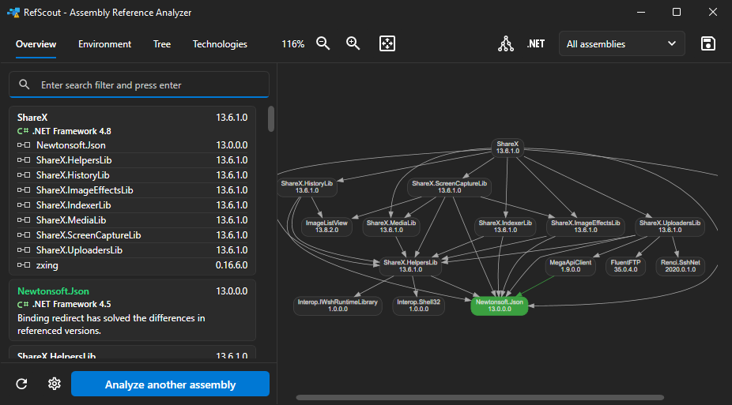

<h1 align="center">&nbsp;&nbsp;RefScout - Reference Analyzer</h1></br>
<p align="center">
  RefScout is a desktop and command-line application that assists you with identifying conflicting assembly references in your .NET Core and .NET Framework applications.<br><br>
  
</p>

<h6 align="center">
  &nbsp;&nbsp;
  <a href="https://dotnet.microsoft.com/download" alt=".NET target"></a>&nbsp;&nbsp;
  &nbsp;&nbsp;By <a href="https://joery.nl">Joery Droppers</a>
</h6>

## Features
 - .NET Core support (+ single file applications) 
 - Interactive desktop application
 - Strong named assemblies
 - .NET Framework config parsing (probing paths, codebase, binding redirects)
 - Reports various conflicts: binding redirect misconfiguration, version mismatch, processor architecture mismatch, missing runtime versions, and more

## Install

<i>The application is still in-preview, and therefore may not function as intended.</i>

**Windows**<br>
[https://github.com/Droppers/AssemblyAnalyzer/releases/download/v-0.1-alpha/win-refscout-0.1.zip](refana-windows-0.1.zip) (Requires .NET 6.0, CLI+Desktop)<br>
[https://github.com/Droppers/AssemblyAnalyzer/releases/download/v-0.1-alpha/win-contained-refscout-0.1.zip](refana-windows-0.1.zip) (Self-contained, CLI)<br>
[https://github.com/Droppers/AssemblyAnalyzer/releases/download/v-0.1-alpha/win-contained-desktop-refscout-0.1.zip](refana-windows-0.1.zip) (Self-contained, Desktop, large: 120MB)<br>

**Linux**<br>
[https://github.com/Droppers/AssemblyAnalyzer/releases/download/v-0.1-alpha/linux-refscout-0.1.zip](refana-linux-0.1.zip) (Requires .NET 6.0, CLI)<br>
[https://github.com/Droppers/AssemblyAnalyzer/releases/download/v-0.1-alpha/linux-contained-refscout-0.1.zip](refana-linux-0.1.zip) (Self-contained, CLI)

**dotnet tool**<br>
`dotnet tool install -g refscout`

## Usage
### Desktop

Drag and drop the application executable or use the "Select an assembly" button to analyze the application. After analyzing, you can click on an assembly in the graph on the right side or in the "Overview" tab to open a pop-up window with more detailed information about that assembly. 

Using the desktop application should speak for itself, otherwise you can find a description of the options below.

### Command-line

```
refscout assembly.exe
refscout assembly.dll
```

#### Options
```sh
refscout [assembly] [options] 

assembly - The .NET assembly (.dll or .exe) to be analyzed. 
-c, --config [path] - specificy the location of the app.config or web.config file, defaults to the  config named the same as the input assembly.
```

**Analyzer options**

```
-a, --analyze [mode] - Specify to which degree assembly references should be analyzed
                     - Values: AppDirectSystem, App, All
-r, --runtime [runtime] - Specify which runtime type should be used for analyzing. Useful for analyzing Mono applications on Windows.
                        - Values: Default, Core, Framework, Mono
-sv, --system-versions [mode] - Specify how strict version mismatches of system assemblies should be reported.
                              - Values: Off, Loose, Strict
-f, --filter [filter] - Specify a query string to filter the results of the analyzer.
```

**Visualizer options**

```
-v, --visualize [mode] - Specify which type of assemblies should be visualized by the visualizer.
                       - Values: Default, All, Conflicts, App
Console
-cd, --console-detail - Show a more detailed information in the console such as target framework and source language.

Dot (GraphViz)
--dot [graph.dot] - Export analyzer results to a GraphViz dot graph.
-dotf, --dot-framework - Include an overview of target frameworks used in assemblies.

DGML (Visual Studio graph)
--dgml [graph.dgml] - Export analyzer results to a Visual Studio DGML graph.
```

## Screenshots

Will be added when UI is finalized.

## Detailed options
These options apply to both the desktop application and the command-line application.

#### Desktop
 - Press the "graph" icon on the top right to toggle the assembly tree direction from top -> bottom to left -> right. 
 - Press the ".NET" icon in the top right corner to toggle the visibility of used target frameworks in your application.
 - Press the "cog wheel" icon next to the analyze button to open the settings dialog for all other options.

#### Analyze mode

By default, the direct system references of the assemblies are analyzed. You can choose to analyze only the application-related assemblies or also to analyze the references of system assemblies.

```sh
-a, --analyze AppDirectSystem # Only analyzes application and direct system references.
              App             # Only analyzes application related references, not system assemblies.
              All             # Analyzes everything, including references of system assemblies.
```

#### Runtime type

By default the application will determine which runtime to use for analyzing based on the given assembly. However, for Mono applications on Windows, it will always use .NET Framework as runtime type. Specifiy this option in order to override this behavior to use Mono.
```sh
-r, --runtime Default   # It automatically determines which runtime the application targets.
              Core      # .NET Core
              Framework # .NET Framework
              Mono      # Mono Runtime
```

#### Visualize mode

Depending on the number of references, visualizing everything can lead to a cluttered result; therefore, you can specify to which degree the result of the analyzer will be visualized. The default value for the console visualizer is "conflicts," for all other visualizers, "all."

```sh
-v, --visualize Default    # default `conflicts` for console, `all` for others
                All        # Visualizes all results from the analyzer.
                Conflicts  # Only visualizes assemblies and references with conflicts.
                App        # Only Visualizes application-related assemblies and references.
```

#### System version cecking

When this option is enabled, the analyzer will also consider differences in referenced system assemblies as conflicts.

```sh
-sv, --system-versions Off    # (default) ignore version mismatches for system assemblies.
                       Loose  # mark breaking version mismatches as non-breaking, ignore minor mismatches.
                       Strict # mark breaking version mismatches as breaking, and minor mismatches as information.
```

#### Filtering results

Filter the analyzer result by providing the `--filter` option or using the desktop application's search input.

The following filter options are available, precede an option with an exclamation mark to do a NOT search (`!by:PaintDotNet`):
 - `by:PainDotNet`: show assemblies that are referenced by PaintDotNet. 
 - `to:PaintDotNet.Data`: show all assemblies that have a reference to PaintDotNet. 
 - `source:GAC`: show all assemblies that have been resolved from a specific source: GAC, Local, CodeBase, NotFound, Error. 
 - `is:conflict`: show conflicting assemblies.
 - `is:unreferenced`: show assemblies which are unreferenced. 
 - `is:system`: show system assemblies. 

An example search filter that will only show conflicting assemblies that are referenced by PaintDotNet is: `from:^PaintDotNet$ is:conflict`

By default, the filter will do a contains search, precede the text query with ^ to do a startsWith search, succeed with a $ to do an endsWith search, and use both for an exact match. 

## Internals

#### Version compatibility

For references to strong-named assemblies, when there is any difference between the referenced and resolved version, it will be displayed as an fatal mismatch. For regular assemblies, versions are deemed compatible if the major and minor versions of the referenced and resolved assembly are identical. If the major version differs, a reference is considered a breaking mismatch, and displayed as a warning. If only the minor version differs, the reference is considered a non-breaking mismatch, and displayed as informative. 

### Architecture mismatch

When the entry assembly targets an architecture other than Any CPU, the processor architecture of each referenced assembly is compared to that of the entry assembly and a warning message is shown in case it differs. This does not mean they are actually incompatible.

#### Classifying System and .NET API assemblies

Some other tools check whether the assembly name starts with System, this will fail for e.g., System.IO.Abstractions, or check for the PublicKeyToken. Non-framework assemblies like EntityFramework also have the same PublicKeyToken, making it unreliable. Instead, a static list containing names of .NET APIs and 'System' assemblies is included with the application. These were obtained through the .NET API Browser and the "RedistList/FrameworkList.xml" files.

#### Assembly resolution

Assemblies are resolved by incorporating a heavily modified version of the assembly resolver found in ILSpy and Mono.Cecil. To more reliably resolve assemblies from the global assembly cache, fusion.dll is invoked directly, as a backup "Assembly.Load" is used to resolve the assembly using the .NET Framework runtime. In case fusion.dll could not resolve the assembly, but the .NET runtime could, the assembly is marked as '[unification](https://patents.google.com/patent/US9009693B2/en)'.

#### Inclusion of local System assemblies

When system assemblies are found locally for a .NET Framework application, they will always be analyzed as part of the analyzed application. 

#### .NET Core runtime detection
The locations that the application will look for .NET Core runtime are the default installation location or the DOTNET_ROOT environment variable. Determining which runtime version will be used when running the application is based on using the roll-forward logic described in the dotnet design document.

## Why?

To get more familiar with C#, WPF and .NET, since this is my first real C# project. Also, as part of my internship, one of my tasks was documenting the dependencies of .NET applications. However, I lacked a tool to generate a complete overview of an assembly and its references. I stumbled upon the popular AsmSpy tool and found it lacks many features. So I decided to try and create a tool to fill the gap of missing features and familiarize myself with how the runtime resolves assemblies.

Compared to for example AsmSpy, a popular reference analyzer tool, RefScout has full support for binding redirects, codebase (local only), probing directories, strong-named assemblies, architecture mismatches, .NET Core (+ single file), detecting GAC unification, Linux support, and a desktop application.

## Contributing
I am always open to contributions in this repository. However, make sure to create an issue beforehand to discuss the change. 

## Thanks to
- [adospace/fluent-ui-xaml](https://github.com/adospace/fluent-ui-xaml) for providing Fluent themed WPF styles.
- [jbevain/cecil](https://github.com/jbevain/cecil) for an awesome assembly file parser.
- [icsharpcode/ILSpy](https://github.com/icsharpcode/ILSpy) for their assembly resolver.
- [ElinamLLC/SharpVectors](https://github.com/ElinamLLC/SharpVectors) for the SVG viewer in the desktop application.

## License
```
MIT License

Copyright (c) 2021 Joery Droppers (https://github.com/Droppers)

Permission is hereby granted, free of charge, to any person obtaining a copy
of this software and associated documentation files (the "Software"), to deal
in the Software without restriction, including without limitation the rights
to use, copy, modify, merge, publish, distribute, sublicense, and/or sell
copies of the Software, and to permit persons to whom the Software is
furnished to do so, subject to the following conditions:

The above copyright notice and this permission notice shall be included in all
copies or substantial portions of the Software.

THE SOFTWARE IS PROVIDED "AS IS", WITHOUT WARRANTY OF ANY KIND, EXPRESS OR
IMPLIED, INCLUDING BUT NOT LIMITED TO THE WARRANTIES OF MERCHANTABILITY,
FITNESS FOR A PARTICULAR PURPOSE AND NONINFRINGEMENT. IN NO EVENT SHALL THE
AUTHORS OR COPYRIGHT HOLDERS BE LIABLE FOR ANY CLAIM, DAMAGES OR OTHER
LIABILITY, WHETHER IN AN ACTION OF CONTRACT, TORT OR OTHERWISE, ARISING FROM,
OUT OF OR IN CONNECTION WITH THE SOFTWARE OR THE USE OR OTHER DEALINGS IN THE
SOFTWARE.
```
